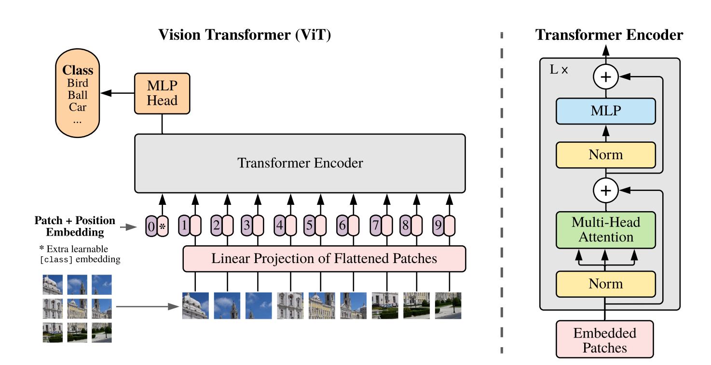
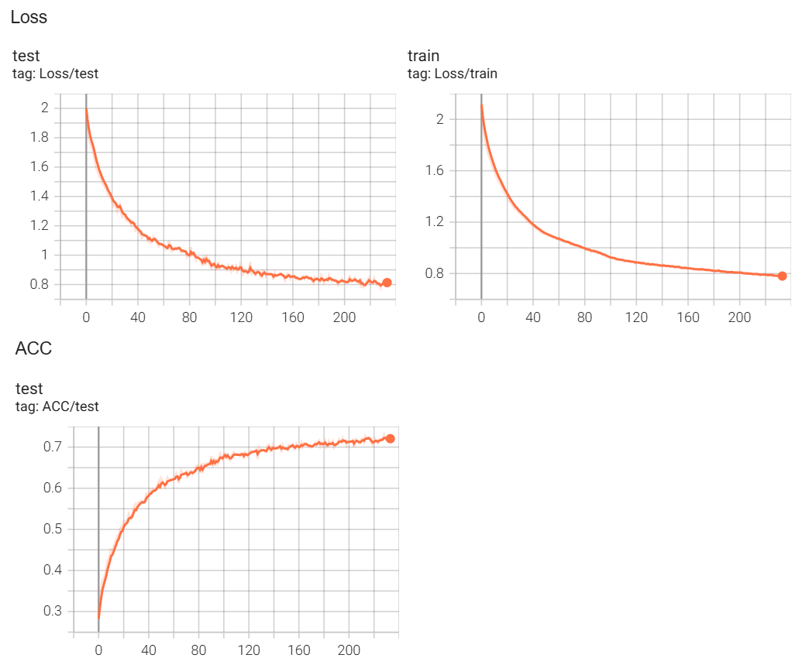
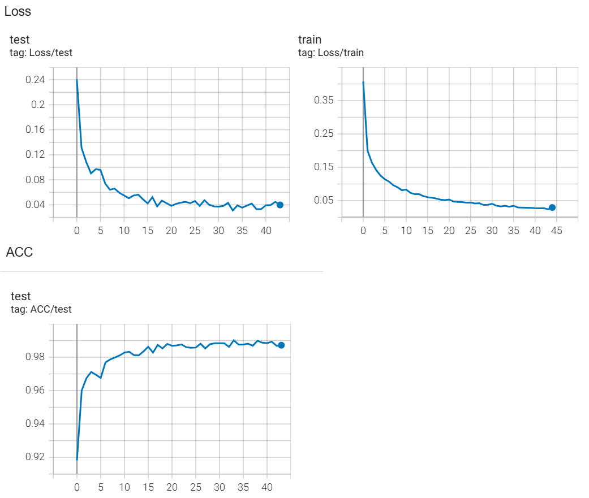

# Vision transformer (VIT) implementattion in PyTorch

This repository contains my PyTorch implementation of the Vision transformer as was introduced in the paper *"An Image is Worth 16x16 Words: Transformers for Image Recognition at Scale"* (source of figure)

The vision transformer works by cutting the original image in patches (eg. 4x4), generating a learned embedding for each patch, adding a positional embedding to each patch embedding, and then using several transformer layers as described in *"Attention Is All You Need". A classification embeddings is also added, which is used in the final layer to output predictions using a single linear layer.

My implementation makes use of a learned positional embedding, and contains the transformer Encoder block as described in the paper. The model itself can be found in *models/vit.py*, and has been demonstrated to work on both MNIST and CIFAR10.

In general the VIT needs a lot more training data than more traditional CNN architectures, and is most often used in combination with rigerous pre-training. This means this implementation is not optimal for the tested datasets, and will also not expected to perform better than more simple CNN models on these datasets. Nevertherless, the used datasets can still be used to demonstrate the correctness of the implementation, and decent validation results should be seen on them.

## CIFAR-10
Classfication on CIFAR-10 (32x32) has been performed using *train_CIFAR10.py* without optimizing any of the hyperparameters or the architecture of the model. Training was performed using 4x4 patcches, and embeddings dim of 256, 8 attention heads and 6 transformer layers. 

After training for 220 epochs, a validation accuracy of 72.9% was seen.

## CIFAR
Classfication on CIFAR has been performed using *train_CIFAR.py* without optimizing any of the hyperparameters or the architecture of the model. Training was performed using 4x4 patcches, and embeddings dim of 256, 8 attention heads and 6 transformer layers. 

After training for 40 epochs, a validation accuracy of 72.9% was seen.

## MNIST
Classfication on MNIST has been performed using *train_MNIST.py* without optimizing any of the hyperparameters or the architecture of the model. Training was performed using 4x4 patcches, and embeddings dim of 128, 4 attention heads and 5 transformer layers. 

After training for 40 epochs, a validation accuracy of 98.9% was seen.

